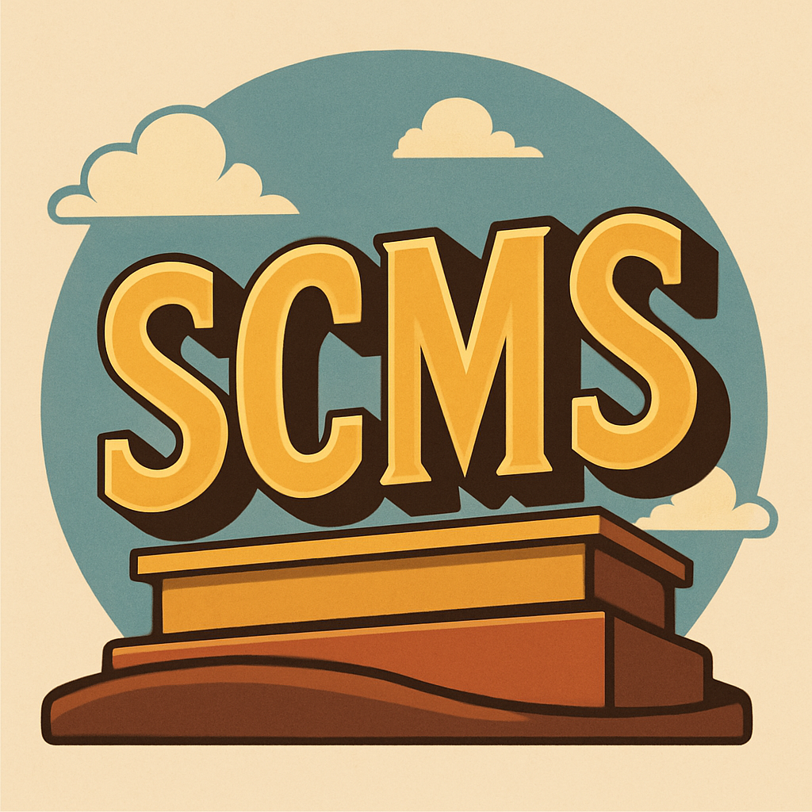

# Simple Content Management System

A lightweight, modular CMS built with .NET Core 8, SQLite, and ASP.NET Identity. Designed for full portability, rich media handling, theming, and insertable content modules.

---

## 🔧 Tech Stack
- .NET Core 8 + Entity Framework Core
- SQLite (portable database)
- ASP.NET Core Identity (role-based auth)
- Dockerized for local + remote deployment
- TinyMCE + Responsive FileManager

---

## ✨ Features

### Content & Pages
- Rich HTML editing via TinyMCE
- Public or Members Only visibility
- Dynamic token injection for layout control
- Full-text search with SQLite FTS5

### Theming System
- Folder-based themes with layouts, partials, and assets
- Designer tokens: `<cms:Content />`, `<cms:Menu />`, `<cms:SearchBar />`, etc.
- Page templates defined per theme

### Insertable Modules
- `<cms:Gallery />`, `<cms:Blog />`, `<cms:Store />`, `<cms:Image />`, `<cms:Slideshow />`
- TinyMCE-compatible insertables
- Tag cloud and citation system for blogs

### Media & File Management
- Upload images, videos, audio, and files
- FileManager integrated with editor
- Gallery folder support for public media blocks

### Navigation
- Dynamic menus with drag-and-drop admin editor
- Breadcrumb token for contextual navigation

### Admin Panel
- Manage pages, blog posts, media, menus, and settings
- Social media links editor
- Portable and self-contained with Docker

---

## 📦 Future Plans
- Storefront integration
- Shopping cart and product modules
- Plugin-based architecture

---

This project is designed to be simple to deploy and flexible to extend.
