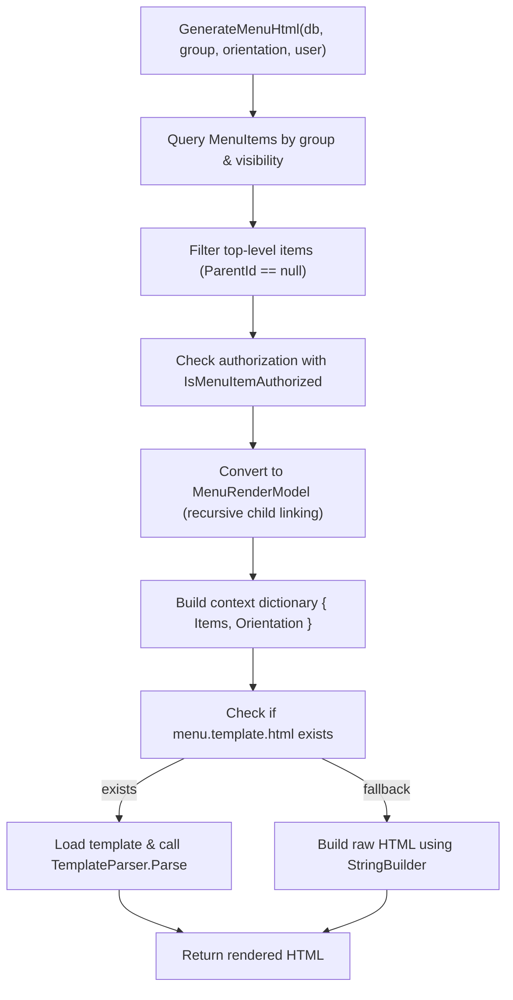

## Menu System Key Files

The SCMS menu system is composed of the following core components:

- **`MenuItem.cs`**  
  Entity Framework model representing individual menu entries, including properties like `Text`, `Url`, `ParentId`, `Order`, and `SecurityLevelId`.

- **`MenuBuilder.cs`**  
  Contains the logic for assembling the menu tree, filtering by visibility and authorization, and rendering it using either a Mustache template or fallback HTML.

- **`MenuRenderModel.cs`**  
  A data transfer object used to build the hierarchical menu model (`Items`, `Children`, etc.) that feeds into the templating engine.

- **`menu.template.html`**  
  A theme-level Mustache-style template that defines how the menu should be rendered in HTML (e.g., dropdowns, vertical lists, etc.).

## SCMS Menu System Overview

The SCMS menu system dynamically generates navigation HTML based on `MenuItem` entities stored in the database. It supports hierarchical menus, user-specific authorization, and theme-aware rendering via Mustache templates.

### 1. `GenerateMenuHtml(db, group, orientation, user)`
This is the entry point of the menu system. It builds the final HTML for a specified menu group (e.g., "main") and orientation ("horizontal" or "vertical").

### 2. Query and Filter MenuItems
The method queries all `MenuItem` records in the specified group that are marked as visible. It filters these to top-level items (i.e., those with `ParentId == null`).

### 3. Authorization Filtering
Each top-level item is passed through `IsMenuItemAuthorized`, which checks if the current user meets the security level required to view the item.

### 4. Recursive Menu Model Assembly
Each top-level item is converted into a `MenuItemModel`, which includes recursively-resolved child items. This creates a complete tree structure suitable for templating.

### 5. Context Dictionary Creation
A context dictionary is assembled for Mustache-style rendering, containing:
- `Items`: the list of top-level `MenuItemModel` objects with nested children
- `Orientation`: the requested orientation (horizontal or vertical)

### 6. Template-Based Rendering (Preferred)
If the current theme includes `menu.template.html`, the file is loaded and passed to `TemplateParser.Parse` along with the context. This allows for full customization of menu layout within the theme.

### 7. Fallback Rendering (Legacy)
If no template is found, a hardcoded HTML structure is generated using `StringBuilder`. This ensures basic navigation is still functional without a custom theme.

### 8. Final Output
The method returns a complete HTML `<ul>` block containing the rendered menu, ready to be inserted into the page layout.

