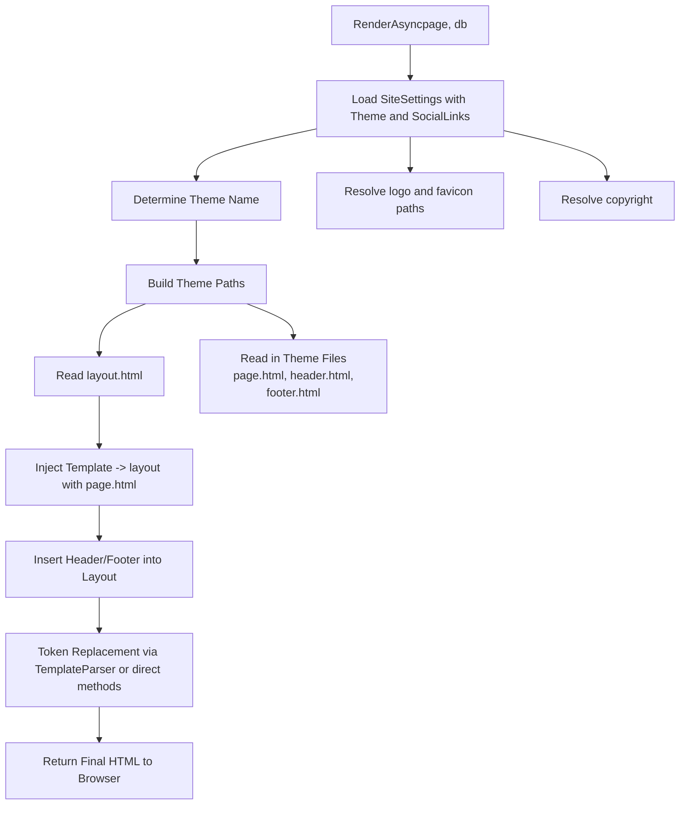
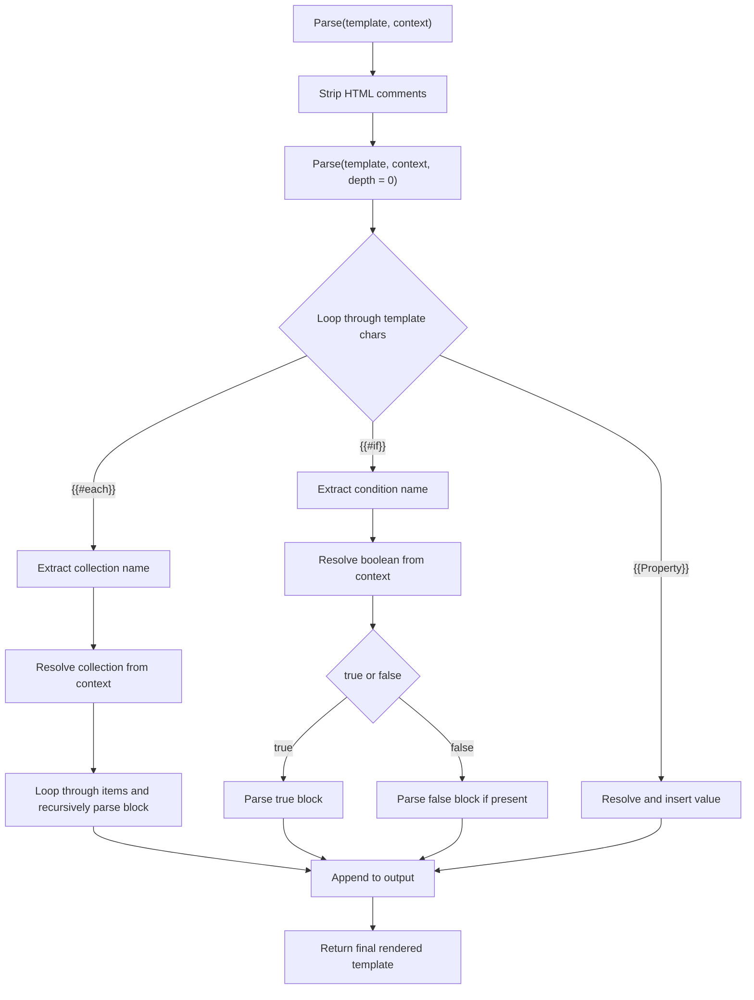

# Theming in SCMS

## Overview

The theming system in SCMS allows developers and designers to control the entire visual presentation and layout of a site. Themes are portable, customizable, and follow a structured file layout to support dynamic content rendering using Razor views.

---

## Theme Folder Structure

Themes may also include static image assets needed by the layout, placed in an `images/` folder for use in backgrounds, logos, icons, or other visual elements.
All themes are stored in `/Themes/{ThemeName}/`. A typical theme layout:

```
/Themes/
  └── default/
      ├── layout.html
      ├── theme.config.json
      ├── partials/
      │   ├── header.html
      │   └── footer.html
      ├── templates/
      │   ├── page.html
      │   ├── blog.html
      │   └── post.html
      ├── css/
      │   └── theme.css
      ├── js/
      │   └── theme.js
      └── images/
          ├── logo.png
          └── background.jpg
```

---

## File Descriptions

### theme.config.json schema

```json
{
  "name": "Default Theme",
  "version": "1.0",
  "author": "SCMS Team",
  "description": "A simple starter theme with Bootstrap layout.",
  "previewImage": "/Themes/default/images/preview.png",
  "defaultTemplate": "page.html",
  "layout": "layout.html"
}
```

- `name`: Display name of the theme  
- `version`: Theme version  
- `author`: Theme creator  
- `description`: Optional summary  
- `previewImage`: Screenshot used in theme selector  
- `defaultTemplate`: Default page template  
- `layout`: Main layout file  

Other files:
- **layout.html**: Base layout for the entire site  
- **partials/**: Shared components like headers and footers  
- **templates/**: Content-specific views  
- **css/** and **js/**: Theme-specific styling and scripts  

---

## Theme Selection & Activation

Themes are activated via the Admin UI or configuration and used to resolve view paths at runtime.

---

## Razor View Resolution

Views are resolved from:

```csharp
/Themes/{ActiveTheme}/layout.html
/Themes/{ActiveTheme}/partials/{PartialName}.html
/Themes/{ActiveTheme}/templates/{TemplateName}.html
```

---

## Theme Installation

Upload `.zip` packages to install themes. They extract to `/Themes/{FolderName}` and allow `.html`, `.json`, `.css`, `.js` only.

---

## Using External Frameworks (e.g., Bootstrap or JavaScript Libraries)

Include CSS via CDN or place JS frameworks in `/js/` and reference them in `layout.html`:

```html
<link href="https://cdn.jsdelivr.net/npm/bootstrap@5.3.0/dist/css/bootstrap.min.css" rel="stylesheet">
<script src="/Themes/default/js/bootstrap.bundle.min.js"></script>
```

---

## Asset Handling Notes

- **Images**: Put in `/images/`  
- **Fonts**: Use `/fonts/` and `@font-face`  
- **JavaScript Libraries**: Place in `/js/`  
- **CSS Frameworks**: Use CDN or `/css/`  
- **Icons**: Inline SVG or bundled in `/images/` or `/fonts/`  
- **Code Styling**: Define `.CodeBlock` class for syntax-highlighted code blocks  
- **Markdown/TinyMCE Content**: Themes should render content from these sources cleanly

---

## Best Practices

- Modular layouts  
- Use partials  
- Avoid hardcoded paths  
- Include `theme.config.json`  
- Support tokens and content editors

---

## Designer Tokens

Use in `.html` files to inject dynamic data:

- `<cms:LoginStatus />` – Login/logout button. **Placement determines where login UI appears**  
- `<cms:SiteLogo />`  
- `<cms:Menu orientation="horizontal|vertical" />`  
- `<cms:Content />`  
- `<cms:PageTitle />`  
- `<cms:CreatedDate />`  
- `<cms:LastUpdated />`  
- `<cms:UpdatedBy />`  
- `<cms:Username />`  
- `<cms:UserEmail />`  
- `<cms:UserRole />`  
- `<cms:IsAuthenticated />`  
- `<cms:SiteTitle />`  
- `<cms:ThemeName />`  
- `<cms:CurrentUrl />`  
- `<cms:Year />`  
- `<cms:SearchBar />`  
- `<cms:SocialLinks />`  
- `<cms:Breadcrumbs />`  
- `<cms:Privacy />`  
- `<cms:License />`  
- `<cms:Copyright />`

---

## Token Rendering Engine Overview

Tokens like `<cms:SiteLogo />` are rendered after Razor view execution. They are safe, flexible, and allow nested Razor logic.

---

## First Theme Example: Simple One-Page Theme

### partials/header.html

```html
<header>
    <div class="logo">@Html.Raw("<cms:SiteLogo />")</div>
    <nav>@Html.Raw("<cms:Menu orientation=\"horizontal\" />")</nav>
</header>
```

### partials/footer.html

```html
<footer>
    <div>@Html.Raw("<cms:Copyright />")</div>
</footer>
```

### layout.html

```html
<!DOCTYPE html>
<html lang="en">
<head>
    <meta charset="UTF-8">
    <title>@RenderSection("Title", false)</title>
    <link href="https://cdn.jsdelivr.net/npm/bootstrap@5.3.0/dist/css/bootstrap.min.css" rel="stylesheet">
    <link rel="stylesheet" href="/Themes/default/css/theme.css" />
</head>
<body>
    @await Html.PartialAsync("partials/header")

    <main>
        @Html.Raw("<cms:Content />")
    </main>

    @await Html.PartialAsync("partials/footer")
</body>
</html>
```

---

This model keeps themes clean, portable, and safe for any SCMS deployment.


### 🖼️ Theme Engine Block Diagram

here is a high level block diagram of the process of rendering a theme to the browser


  
## ThemeEngine.RenderAsync Execution Flow

### 1. `RenderAsync(page, db)`
The main entry point for rendering a page using a theme. Accepts a `PageContent` object and a database context.

### 2. Load SiteSettings with Theme and SocialLinks
Fetches the `SiteSettings` entity including the current theme and any associated social links using Entity Framework Core.

### 3. Determine Theme Name
If a theme is configured in the site settings, it is used; otherwise, the default `"default"` theme is selected.

### 4. Build Theme Paths
Constructs the file paths to access theme assets such as layout, header, footer, and template files.

### 5. Read `layout.html`
Loads the base HTML layout file which serves as the outer wrapper for the rendered page.

### 6. Read in Theme Files
Loads additional theme files:
- `templates/page.html` – Defines the main content layout
- `partials/header.html` – Header content
- `partials/footer.html` – Footer content

### 7. Resolve logo and favicon paths
Builds the full URL paths for the site logo and favicon based on the selected theme and site settings.

### 8. Resolve copyright
Uses site settings if available; otherwise, defaults to a generic © line with the current year.

### 9. Inject Template → Layout
The content from `page.html` is inserted into the layout in its designated location.

### 10. Insert Header/Footer into Layout
Places header and footer content into the appropriate slots in the layout.

### 11. Token Replacement
Processes all SCMS tokens (e.g., `<cms:SiteLogo />`, `<cms:LoginStatus />`, `<cms:Content />`) using either inline replacement or a `TemplateParser` class to substitute live data.

### 12. Return Final HTML to Browser
Returns the fully assembled HTML string ready to be served to the browser.

### 🖼️ Template Parser Block Diagram



## TemplateParser Execution Flow

### 1. `Parse(template, context)`
The public entry point. Accepts a template string and a context dictionary of values. Begins processing by stripping HTML comments and calling the recursive parser.

### 2. Strip HTML Comments
Removes all `<!-- ... -->` blocks before any parsing begins. Ensures comments don't interfere with rendering.

### 3. Recursive Parse Call
The method `Parse(template, model, depth)` is used recursively to walk through the template content and resolve tokens.

### 4. Loop Through Template Characters
The parser walks character-by-character through the template, looking for recognizable tokens like `{{#each}}`, `{{#if}}`, and `{{Property}}`.

### 5. `{{#each CollectionName}} ... {{/each}}`
- Extracts the collection name from the directive.
- Resolves it from the context.
- Iterates over each item and recursively processes the block using that item as the model.

### 6. `{{#if PropertyName}} ... {{/if}}`
- Extracts the property name.
- Resolves it to a boolean value from the context.
- If true, renders the enclosed block.
- If false and `{{else}}` is present, renders the alternate block.

### 7. `{{PropertyName}}`
- Resolves the property from the context object or current item.
- Replaces the token with its string value in the output.

### 8. Output Assembly
All resolved fragments are appended into a `StringBuilder`.

### 9. Return Rendered Template
Once all characters have been processed, the final string is returned with all replacements and blocks rendered.

## Mustache-style markup
The SCMS theming system uses a lightweight Mustache-style template engine to enable dynamic content rendering within theme files. 

This engine supports three primary token types: `{{PropertyName}}` for inserting simple values, `{{#if PropertyName}} ... {{/if}}` for conditional content based on boolean properties, and `{{#each CollectionName}} ... {{/each}}` for looping over collections like menu items or page lists. 

In addition to these generic tokens, SCMS also supports a set of custom CMS-specific tags such as `<cms:SiteLogo />`, `<cms:LoginStatus />`, `<cms:UserName />`, and `<cms:Content name="..." />`, which are replaced during the render phase to insert application-specific content. This approach provides flexible theming capabilities without requiring Razor or server-side code in theme files, allowing designers to focus on layout and structure while developers manage logic in code.

## Supported `<cms:... />` Tokens

The following tokens are supported across `ThemeEngine.cs` and `TemplateParser.cs`, enabling dynamic content rendering in SCMS themes:

- `<cms:Breadcrumb />` – Renders a breadcrumb trail based on the current page's menu hierarchy.
- `<cms:Content name="..." />` – Inserts page-specific or named content regions.
- `<cms:Copyright />` – Displays the site's copyright notice.
- `<cms:ErrorMessage />` – Outputs an error message block, typically used on failed actions or redirects.
- `<cms:Favicon />` – Renders the `<link rel="icon">` element based on site settings.
- `<cms:Footer />` – Injects the footer template content.
- `<cms:Header />` – Injects the header template content.
- `<cms:LoginStatus />` – Displays login/logout links based on authentication status.
- `<cms:Menu orientation="horizontal|vertical" />` – Renders the site's navigation menu.
- `<cms:PageTitle />` – Outputs the current page's title.
- `<cms:SiteLogo />` – Displays the site’s logo image.
- `<cms:SocialLinks />` – Renders a list of configured social media icons and links.
- `<cms:Tagline />` – Displays the site’s tagline text from settings.
- `<cms:UserName />` – Displays the current user's username, or "Guest" if not logged in.
