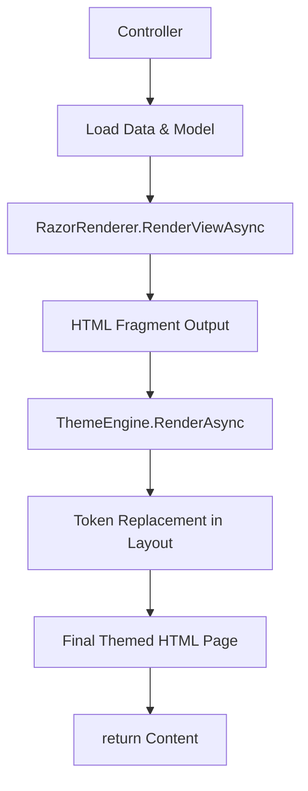

## 🧭 Razor View Rendering Through ThemeEngine

### ⚙️ Process Overview

1. **Controller prepares data:**
   - Fetch model (e.g., `SiteSettings`)
   - Fetch related ViewData values (e.g., list of themes)

2. **Render Razor view to HTML string:**
   - Use `RazorRenderer.RenderViewAsync<TModel>()`
   - Pass the model and any extra ViewData

3. **Wrap Razor-rendered HTML with theme:**
   - Construct a `PageContent` object with:
     - `Title` (e.g., "Site Settings")
     - `HtmlContent` from RazorRenderer
   - Pass it to `ThemeEngine.RenderAsync(...)`

4. **ThemeEngine injects content into layout:**
   - Loads layout and template files from selected theme
   - Replaces `<cms:Content />`, `<cms:PageTitle />`, etc.
   - Outputs fully rastered HTML

5. **Return HTML to browser:**
   - `return Content(html, "text/html");`

---

### 🖼️ Diagram

